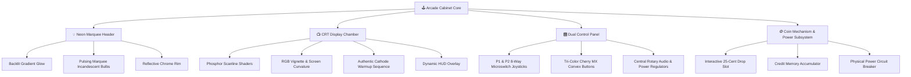

# 🕹️ RETRO ARCADE — The Ultimate 80s/90s Virtual Cabinet Experience 🕹️

<div align="center">

```
  ██████╗ ███████╗████████╗██████╗  ██████╗      █████╗ ██████╗  ██████╗ █████╗ ██████╗ ███████╗
  ██╔══██╗██╔════╝╚══██╔══╝██╔══██╗██╔═══██╗    ██╔══██╗██╔══██╗██╔════╝██╔══██╗██╔══██╗██╔════╝
  ██████╔╝█████╗     ██║   ██████╔╝██║   ██║    ███████║██████╔╝██║     ███████║██║  ██║█████╗  
  ██╔══██╗██╔══╝     ██║   ██╔══██╗██║   ██║    ██╔══██║██╔══██╗██║     ██╔══██║██║  ██║██╔══╝  
  ██║  ██║███████╗   ██║   ██║  ██║╚██████╔╝    ██║  ██║██║  ██║╚██████╗██║  ██║██████╔╝███████╗
  ╚═╝  ╚═╝╚══════╝   ╚═╝   ╚═╝  ╚═╝ ╚═════╝     ╚═╝  ╚═╝╚═╝  ╚═╝ ╚═════╝╚═╝  ╚═╝╚═════╝ ╚══════╝
```

### *Insert Coin. Press Start. Relive the Golden Age of Gaming in Your Browser.*

<p align="center">
  
  
  
  
  
  
  
</p>

[🎮 Play Now](#-quick-start) • [🕹️ Game Vault](#-the-21-game-vault) • [✨ Cabinet Features](#-cabinet-anatomy--immersion) • [⚡ Tech Architecture](#-technical-architecture) • [⌨️ Controls](#-universal-control-matrix)

</div>

---

## 🌟 Overview

**Retro Arcade** is an ultra-immersive, lovingly crafted homage to the golden era of coin-operated arcade machines. Built using **React 18**, **TypeScript**, **Vite**, and high-performance **CSS CRT Shader Simulation**, this project turns your modern browser into a neon-drenched, coin-swallowing, scanline-radiating arcade cabinet.

Step up to the machine, drop a virtual token into the glowing coin slot, watch the cathode-ray tube screen warm up with phosphor decay, and play **21 completely standalone retro games** spanning from the dawn of 1972 to the 1990s fighting game revolution.

---

## 📸 Arcade Experience Showcase

```
+-------------------------------------------------------------+
|  [===]  N E O N   M A R Q U E E   B A C K L I G H T   [===] |
+-------------------------------------------------------------+
| .---------------------------------------------------------. |
| | [CRT SCANLINES] [PHOSPHOR BLOOM] [BARREL DISTORTION]    | |
| |                                                         | |
| |     🟡 PAC-MAN        👾 SPACE INVADERS   🧩 TETRIS     | |
| |     👊 STREET FIGHTER 🚀 GALAGA           🦍 DK         | |
| |     🐸 FROGGER        ☄️ ASTEROIDS        ⚔️ MK         | |
| |                                                         | |
| |   >>> CREDITS: 03 <<<           >>> HIGH SCORE: 999990 <<< | |
| '---------------------------------------------------------' |
+-------------------------------------------------------------+
|  (O)  (P1 JOYSTICK)   [🔴][🔵][🟡]   [INSERT COIN]   (P2)  (O) |
+-------------------------------------------------------------+
|                  [ 🪙 COIN RETURN DOOR ]                     |
+-------------------------------------------------------------+
```

---

## ✨ Cabinet Anatomy & Immersion



### 🎛️ Cabinet Highlights
* **💡 Glowing Marquee**: Dual flashing beacon lamps with animated gradient light sweeps.
* **📺 Authentic CRT Emulation**:
  * Real-time CSS scanlines with variable interlacing.
  * Curvature bezel distortion with ambient edge glow and glass reflections.
  * Phosphor bloom & 8-bit text glow filter.
* **🪙 Coin Mechanism**: Realistic credit tracking system — drop coins into the slot to rack up lives and play credits.
* **⚡ Master Power Switch**: Flip the heavy-duty cabinet power toggle to watch the screen power cycle with CRT power-down collapse animations.
* **🔊 Dual Stereo Speakers**: High-fidelity speaker grilles built into the cabinet chassis.

---

## 🕹️ The 21-Game Vault

Explore 21 meticulously crafted retro arcade games spanning 3 decades of video game history:

| # | Game | Year | Genre | Rating | Signature Mechanics & Gameplay | Icon |
|:---:|:---|:---:|:---:|:---:|:---|:---:|
| **01** | **PAC-MAN** | 1980 | Action / Maze | `4.9 ★` | Dot-munching labyrinth, Blinky/Pinky/Inky/Clyde ghost AI, Power Pellets | 🟡 |
| **02** | **SPACE INVADERS** | 1978 | Shoot 'em Up | `4.8 ★` | Descending alien waves, defensive destructible bunkers, mystery flying saucer | 👾 |
| **03** | **TETRIS** | 1984 | Puzzle | `4.9 ★` | 7 tetromino matrix, line-clear flash, gravity acceleration, rotation physics | 🧩 |
| **04** | **DONKEY KONG** | 1981 | Platformer | `4.7 ★` | Sloped girder navigation, barrel jumping, hammer smashes, rescue Pauline | 🦍 |
| **05** | **STREET FIGHTER II** | 1991 | Fighting | `4.8 ★` | Health bars, Hadouken projectiles, dragon punches, combo timing | 👊 |
| **06** | **GALAGA** | 1981 | Shoot 'em Up | `4.6 ★` | Alien dive-bombing attack vectors, tractor-beam ship capture, dual fighters | 🚀 |
| **07** | **FROGGER** | 1981 | Action | `4.5 ★` | Heavy highway traffic dodge, floating log river hops, diving turtles | 🐸 |
| **08** | **CENTIPEDE** | 1980 | Shooter | `4.4 ★` | Mushroom forest grid, splitting centipede segments, spiders & fleas | 🐛 |
| **09** | **ASTEROIDS** | 1979 | Vector Shooter | `4.6 ★` | Zero-G inertia physics, screen wraparound, asteroid splitting, alien saucers | ☄️ |
| **10** | **Q*BERT** | 1982 | Isometric Puzzle | `4.3 ★` | Isometric pyramid hops, tile color conversions, Coily snake evasion | 🔶 |
| **11** | **DEFENDER** | 1981 | Horizontal Shooter | `4.5 ★` | Bi-directional high-speed radar scanner, alien abductions, smart bombs | 🛸 |
| **12** | **JOUST** | 1982 | Action Platformer | `4.2 ★` | Flying ostrich flapping physics, altitude lance jousting, lava troll hazards | 🦅 |
| **13** | **MISSILE COMMAND** | 1980 | Strategy Shooter | `4.4 ★` | 3-Base anti-ICBM missile defense, explosive radius flak, nuclear city protection | 🚀 |
| **14** | **PITFALL!** | 1982 | Adventure | `4.3 ★` | Jungle vine swinging, crocodile snapping jaws, rolling logs, gold bars | 🌴 |
| **15** | **BUBBLE BOBBLE** | 1986 | Platformer | `4.6 ★` | Trap enemies inside floating bubbles, chain-reaction pop combos, fruit rewards | 🫧 |
| **16** | **TEMPEST** | 1981 | 3D Tube Shooter | `4.4 ★` | Rotary 3D geometric web shooter, rim crawling, Superzapper blast | 🔻 |
| **17** | **ROBOTRON: 2084** | 1982 | Twin-Stick Shooter | `4.5 ★` | 360-degree killer robot horde survival, rescuing the last human family | 🤖 |
| **18** | **SNAKE** | 1972 | Classic Action | `4.1 ★` | Continuous growth velocity, apple foraging, self-collision detection | 🐍 |
| **19** | **PONG** | 1972 | Sports / Arcade | `4.1 ★` | The historic genesis of video games — 2-player paddle deflection & rally | 🏓 |
| **20** | **PAPERBOY** | 1985 | Isometric Action | `4.2 ★` | Suburban obstacle course, dog chases, trick throws into subscriber mailboxes | 📰 |
| **21** | **MORTAL KOMBAT** | 1992 | Fighting | `4.7 ★` | Brutal hand-to-hand combat, round counters, stamina bars, finishing moves | ⚔️ |

---

## ⌨️ Universal Control Matrix

| Control Action | Key Binding | Cabinet Hardware Equivalent |
|:---|:---:|:---|
| **Move Up / Jump / Climb** | <kbd>▲ Up Arrow</kbd> / <kbd>W</kbd> | Joystick Up |
| **Move Down / Crouch** | <kbd>▼ Down Arrow</kbd> / <kbd>S</kbd> | Joystick Down |
| **Move Left / Steer** | <kbd>◄ Left Arrow</kbd> / <kbd>A</kbd> | Joystick Left |
| **Move Right / Steer** | <kbd>► Right Arrow</kbd> / <kbd>D</kbd> | Joystick Right |
| **Primary Action (Fire / Punch / Jump)** | <kbd>Space</kbd> | Red Action Button 🔴 |
| **Secondary Action (Special / Kick)** | <kbd>Enter</kbd> / <kbd>Z</kbd> | Blue Action Button 🔵 |
| **Rotate Piece / Alt Move** | <kbd>▲ Up Arrow</kbd> / <kbd>X</kbd> | Yellow Action Button 🟡 |
| **Insert Coin / Add Credit** | <kbd>Click Coin Slot</kbd> | 25¢ Quarter Drop Slot 🪙 |
| **Power On / Off** | <kbd>Power Button</kbd> | Rocker Toggle Switch ⚡ |
| **Return to Game Select** | <kbd>Back to Menu</kbd> | Cabinet Menu Reset |

---

## ⚡ Technical Architecture

```
Retro-Arcade-Gaming-Website/
├── 📁 src/
│   ├── 📁 components/
│   │   ├── 📁 games/                  # 21 Standalone Game Engines
│   │   │   ├── 👾 AsteroidsGame.tsx      # Vector physics & inertia calculations
│   │   │   ├── 🫧 BubbleBobbleGame.tsx   # Bubble float physics & collision
│   │   │   ├── 🐛 CentipedeGame.tsx      # Mushroom grid & segmented entity logic
│   │   │   ├── 🛸 DefenderGame.tsx       # Horizontal radar & entity tracking
│   │   │   ├── 🦍 DonkeyKongGame.tsx     # Gravity, ladders & projectile physics
│   │   │   ├── 🐸 FroggerGame.tsx        # Multi-lane moving barrier collisions
│   │   │   ├── 🚀 GalagaGame.tsx         # Spline paths & projectile sweeps
│   │   │   ├── 🦅 JoustGame.tsx          # Flapping velocity & altitude combat
│   │   │   ├── 🚀 MissileCommandGame.tsx # Radial explosion flak geometry
│   │   │   ├── ⚔️ MortalKombatGame.tsx   # Hitbox detection & health state engine
│   │   │   ├── 🟡 PacManGame.tsx         # Pathfinding & tile maze engine
│   │   │   ├── 📰 PaperboyGame.tsx       # Isometric scroll & obstacle triggers
│   │   │   ├── 🌴 PitfallGame.tsx        # Timing windows & terrain transitions
│   │   │   ├── 🏓 PongGame.tsx           # Paddle angle reflection vectors
│   │   │   ├── 🔶 QBertGame.tsx          # Isometric pyramid graph mapping
│   │   │   ├── 🤖 RobotronGame.tsx       # 360 twin-stick particle collision
│   │   │   ├── 🐍 SnakeGame.tsx          # Dynamic linked array coordinate grid
│   │   │   ├── 👾 SpaceInvadersGame.tsx  # Step-synchronous alien grid descent
│   │   │   ├── 👊 StreetFighterGame.tsx  # Fighter state machine & hurtboxes
│   │   │   ├── 🔻 TempestGame.tsx        # Geometric 3D vector perspective math
│   │   │   └── 🧩 TetrisGame.tsx         # SRS-style rotation & line-clear matrix
│   │   ├── 🕹️ ArcadeMachine.tsx       # Cabinet frame, marquee, coin & power controller
│   │   ├── 📺 GameScreen.tsx          # Game lifecycle host, HUD & score orchestrator
│   │   ├── 🎮 GameSelector.tsx        # 80s Carousel game picker with ratings & metadata
│   │   └── ⏳ LoadingScreen.tsx        # BIOS/RAM check boot sequence with CRT bloom
│   ├── 📁 data/
│   │   └── 📜 games.ts                # Metadata registry, release years & descriptions
│   ├── 📁 types/
│   │   └── 📜 game.ts                 # TypeScript interfaces for games & cabinet states
│   ├── 🎨 index.css                   # Custom CRT shaders, scanlines & neon keyframes
│   ├── ⚡ App.tsx                     # Main app root & power management
│   └── 🚀 main.tsx                    # React DOM entrypoint
├── 📦 package.json                    # Project dependencies & scripts
├── ⚙️ tailwind.config.js              # Theme extension & color palettes
├── 🛠️ tsconfig.json                   # TypeScript compiler configuration
└── ⚡ vite.config.ts                  # Vite build and plugin configuration
```

---

## 🛠️ Technology Stack

| Layer | Technology | Purpose |
|:---|:---|:---|
| **Frontend Framework** | `React 18` | Declarative UI, state management, render optimization |
| **Language** | `TypeScript 5.5` | Strict type safety, modular game entities, clean interfaces |
| **Build Tool** | `Vite 5` | Instant Hot Module Replacement (HMR) & lightning-fast builds |
| **Styling & UI** | `Tailwind CSS 3.4` | Modern utility classes paired with pixel-perfect responsive layouts |
| **CRT & Shader FX** | `Pure Vanilla CSS` | Scanlines, phosphor glow, curvature vignettes, neon lighting |
| **Typography** | `Google Fonts` | *'Press Start 2P'* (8-bit arcade) & *'Orbitron'* (futuristic sci-fi) |
| **Iconography** | `Lucide React` | High-fidelity vectors for cabinet buttons, coins, audio & power |

---

## 🚀 Quick Start

Get your local arcade up and running in under 60 seconds:

### 1️⃣ Clone the Repository
```bash
git clone https://github.com/mittalshivam226/Retro-Arcade-Gaming-Website.git
cd Retro-Arcade-Gaming-Website
```

### 2️⃣ Install Dependencies
```bash
npm install
```

### 3️⃣ Launch the Dev Arcade
```bash
npm run dev
```

Open your browser and navigate to:
```
http://localhost:5173
```

### 4️⃣ Production Build
```bash
npm run build
npm run preview
```

---

## 🔮 CRT Shader Engine Highlights

The visual authenticity of **Retro Arcade** is driven by custom CSS display engineering:

```css
/* Authentic phosphor scanline interlacing */
.scanlines {
  background: repeating-linear-gradient(
    0deg,
    rgba(0, 0, 0, 0.4),
    rgba(0, 0, 0, 0.4) 1px,
    transparent 1px,
    transparent 2px
  );
}

/* CRT Screen bloom & vignette edge curvature */
.crt-screen {
  box-shadow: 
    inset 0 0 50px rgba(0, 255, 0, 0.1),
    0 0 20px rgba(0, 255, 0, 0.2);
}
```

* **Phosphor Persistence**: Emulates classic green/amber phosphor trails.
* **Glass Reflection**: Simulated curved glass lens glare across the viewport.
* **Scanline Interlacing**: Ultra-crisp sub-pixel raster scanline reproduction.

---

## 🎯 Roadmap & Future Expansions

- [ ] 🏆 **Global High Scores**: Supabase / Firebase leaderboard integration.
- [ ] 🎵 **8-Bit Chiptune Synthesizer**: Web Audio API retro sound effects & background tunes.
- [ ] 🎮 **Gamepad API**: Native USB / Bluetooth arcade joystick & Xbox/PlayStation controller support.
- [ ] 👥 **Multiplayer Co-Op**: WebRTC peer-to-peer 2-player cabinet battles.
- [ ] 💾 **Memory Cards**: LocalStorage state saves & custom retro player tags.

---

## 🤝 Contributing

Contributions, game ideas, and retro enhancements are welcome with open arms!

1. **Fork the Repository**
2. **Create your Feature Branch**: `git checkout -b feature/AddGalaxian`
3. **Commit your Changes**: `git commit -m 'feat: Add Galaxian game module'`
4. **Push to the Branch**: `git push origin feature/AddGalaxian`
5. **Open a Pull Request**

---

## 📜 License

Distributed under the **MIT License**. See `LICENSE` for more information.

---

<div align="center">

### 🌟 Made with ❤️, Nostalgia & Endless Quarters 🌟

**[⬆ Back to Top](#-retro-arcade--the-ultimate-80s90s-virtual-cabinet-experience-)**

</div>